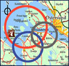

 SaTScan - Software for the spatial, temporal, and space-time scan statistics
====
SaTScan™ is a free software that analyzes spatial, temporal and space-time data using the spatial, temporal, or space-time scan statistics. It is designed for any of the following interrelated purposes:

-   Perform geographical surveillance of disease, to detect spatial or space-time disease clusters, and to see if they are statistically significant.
-  Test whether a disease is randomly distributed over space, over time or over space and time.
-   Evaluate the statistical significance of disease cluster alarms.
-   Perform repeated time-periodic disease surveillance for early detection of disease outbreaks.

The software may also be used for similar problems in other fields such as archaeology, astronomy, botany, criminology, ecology, economics, engineering, forestry, genetics, geography, geology, history, neurology or zoology.

You can find more information about SaTScan on the <a target="_blank" href="https://www.satscan.org/">homepage</a> and in the <a target="_blank" href="https://www.satscan.org/cgi-bin/satscan/register.pl/SaTScan_Users_Guide.pdf?todo=process_userguide_download">user guide</a>. Prebuilt installers for Windows, Linux, and macOS are <a target="_blank" href="https://www.satscan.org/download.html">also available</a>.

License
-------

SaTScan source code is released under the following terms:

Copyright &copy; 2023 [Martin Kulldorff](mailto:kulldorff@satscan.org)

Without warranty of any kind, permission is hereby granted to any person to copy, publish, distribute, and share all or portions of this open-source SaTScan Software; to use, modify, merge, adapt, and build upon the Software; and to publish and distribute derivates of the Software, so long as (i) attribution is given to the creator, (ii) the above copyright and this permission notice is included with all copies of the Software and portions of the Software, and (iii) any published, distributed or shared modification, adaption or derivative of the Software must be shared under identical licensing and permission terms.

Building Native Binaries
-----------
The following are the prerequisites for compiling the command-line C/C++ application and dynamic-link library (.dll) / shared objects file (.so) / java native interface library (.jnilib). 
### General Prerequisites
- Boost C++ Libraries, current version <a target="_blank" href="https://www.boost.org/users/history/version_1_81_0.html">1.81.0</a> (libraries do not need to be build).
- Java Development Kit 17
### Windows
#### Prerequisites
- Visual Studio 2022
- Microsoft Windows SDK v10.0 (or newer)

The Visual Studio Solution references relative paths to the Boost library and JDK C++ headers. These can be either copied into the repository directory or a symbolic link can be created using mklink to reference shared resources:
- boost\boost_1_81_0\
 ex. mklink /d boost *"C:\Users\joeuser\boost"*
- jdk\include\
  ex. mklink /d jdk *"C:\Program Files\Eclipse Adoptium\jdk-17.0.9.9-hotspot"*
### Linux
#### Prerequisites
- GCC (compiled with 4.8.5 or 8.5.0 currently)

The Linux binaries are built through the [Linux build_binaries](scripts/linux/build_binaries) shell script.
### macOS
#### Prerequisites
- Apple clang 17

The macOS binaries are built through the [macOS build_binaries](scripts/mac/build_binaries) shell script.

Building Java User Interface
-----------
The Java user interface provides the graphical front-end to the native library file written in C/C++ (.dll/.so/.jnilib).
### Prerequisites
- NetBeans (<a target="_blank" href="https://netbeans.apache.org/">Version 19</a>)
- Java Development Kit 17

Architecture
-----------
See our [architecture document](architectural.md) for an overview of the source code design.
