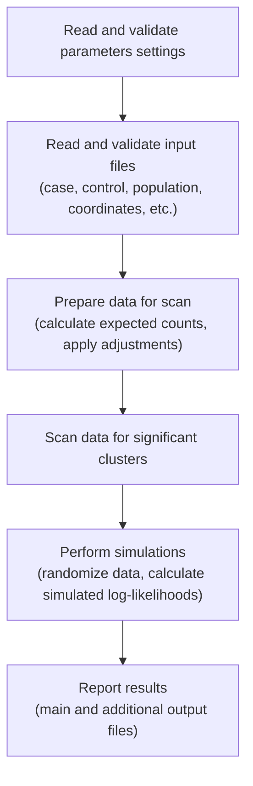
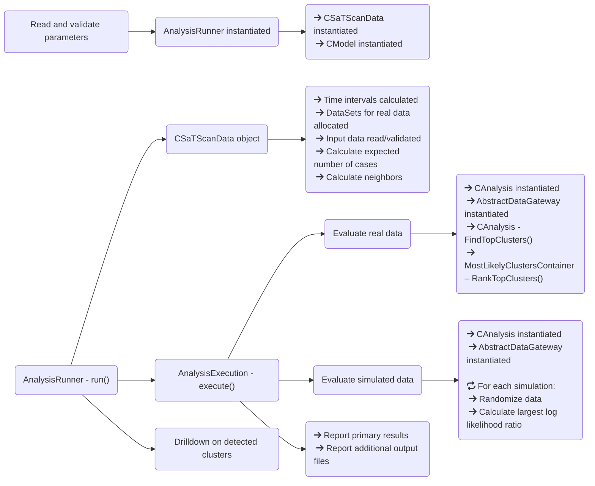

Architecture
==== 
> An Architectural Guide for Developers

 Source Code Organization Overview
-------
### Calculation Engine
The core of the source code is the calculation engine, which defines the many algorithms and supporting functionalities which operate on the parameter settings and data files to perform the scan then produce the analysis result files. It is divided into 11 logical groups which largely reflect the object oriented design: analysis, analysis run, cluster, log likelihood, output, print, probability model, randomization, data, utility, and parameters. The source code is C/C++ and compiles on Windows, Linux, and macOS.

### Shared Library
The shared library extends the calculation engine to expose the analysis routines to a larger program, in this case, the graphical user interface. The library uses the Java Native Interface to bridge between the calculation engine and the Java GUI. The library code is also writen in C/C++ and compiles on Windows, Linux, and macOS.

### Graphical User Interface
The graphical user interface is written in Java. The GUI provides the user with a friendly interface for creating, editing, executing, and reviewing analyses. All analysis execution is performed in the calculation engine, with the shared library facilitating the interactions between Java and C/C++ code.

### Calculation Engine Execution Flow

### Key Classes and Inheritance
#### [Analysis Setup/Execution: AnalysisRunner, AnalysisExecution](calculation/analysis_run/AnalysisRun.h)
The AnalysisRunner and AnalysisExecution classes orchestrate the overall execution flow. The AnalysisRunner prepares the analysis by creatingdata structures, reads the input files, and calculating neighbors about each centroid, while the AnalysisExecution scans real, executes the simulations, then generates the result files.

#### [Data Hub: CSaTScanData](calculation/satscan_data/SaTScanData.h)
The CSaTScanData class hierarchy defines methods and processes for:
- the coordinated reading, validation, and storage of input data.
- providing a central interface for accessing and manipulating data.

The CSaTScanData class is pure virtual, defining these key virtual methods:
- ReadDataFromFiles: calculates time intervals start times and reads data as required by probability model and analysis type
- CalculateMeasure: calculates the expected number of cases as required by probability model and analysis type
- FindNeighbors: calculates the adjacent locations about a centroid; stores results in sorted array
- RandomizeData: coordinates the creation of randomized data as required for probability model and analysis type

These methods are defined by derived classes to implement appropriate logic for requested analysis (purely spatial, space-time, etc.). There are 4 classes that derive from CSaTScanData:
- [CPurelySpatialData](calculation/satscan_data/PurelySpatialData.h)  - purely spatial analysis
- [CPurelyTemporalData](calculation/satscan_data/PurelyTemporalData.h) - purely temporal analysis
- [CSpaceTimeData](calculation/satscan_data/SpaceTimeData.h) - space-time analysis
- [CSVTTData](calculation/satscan_data/SVTTData.h) - spatial variation in temporal trends analysis

The CSaTScanData class hierarchy utilizes many other classes to accomplish its tasks, central to these is DataSetHandler. For instance, the functions RandomizeData() and ReadDataFromFiles() perform some surrounding work  but the brunt of the process is performed by the DataSetHandler object. A similar situation exists between CSaTScanData and the CModel class (discussed later) in regards to function CalculateMeasure().

#### [Data Sets: DataSetHandler](calculation/satscan_data/DataSetHandler.h), [DataSet](calculation/satscan_data/DataSet.h)
There are many data structures in SaTScan which maintain input and calculated data; these structures are encapsulated in the same class to facilitate multiple data sets. The DataSet class organizes these structures and associated methods that act upon those structures. The DataSetHandler classes manage these collections of DataSets and defines methods that apply to those sets.

The [DataSet](calculation/satscan_data/DataSet.h) class defines data structures and methods for allocating, containing, manipulating, deallocating and providing direct  access to input and calculated data; example being the case arrays, measure arrays, and population data. Each input set is maintained separately through these classes.

There are 2 DataSet classes:
- RealDataSet: data structures for containing real data
- DataSet: data structures for containing simulated data

The [DataSetHandler](calculation/satscan_data/DataSetHandler.h) class maintains a collection of RealDataSet objects and defines methods to apply against these objects as a collection. It defines two major processes performed on data: reading and randomization. The DataSetHandler class is pure virtual, defining these key virtual methods:
- ReadData: defines procedures for reading input data into RealDataSet objects, with specilaized routines defined for probability models
- RandomizeData: generates randomized data through randomizer objects (discussed later)

These methods are defined by derived classes to implement appropriate algorithms and logic for requested probability model (Poisson, Bernoulli, etc.). There are 9 classes that derive from DataSetHandler to implement routines specific to the probability model:
- [BernoulliDataSetHandler](calculation/satscan_data/BernoulliDataSetHandler.h)  - Bernoulli model
- [PoissonDataSetHandler](calculation/satscan_data/PoissonDataSetHandler.h)  - Poisson model
- [SpaceTimePermutationDataSetHandler](calculation/satscan_data/SpaceTimePermutationDataSetHandler.h)  - space-time permutation
- [OrdinalDataSetHandler](calculation/satscan_data/OrdinalDataSetHandler.h) - ordinal model
- [ExponentialDataSetHandler](calculation/satscan_data/ExponentialDataSetHandler.h) - exponential model
- [NormalDataSetHandler](calculation/satscan_data/NormalDataSetHandler.h)  - normal model
- [UniformTimeDataSetHandler](calculation/satscan_data/UniformTimeDataSetHandler.h) - uniform time model
- [HomogeneousPoissonDataSetHandler](calculation/satscan_data/HomogeneousPoissonDataSetHandler.h)- homogeneous Poisson model
- [RankDataSetHandler](calculation/satscan_data/RankDataSetHandler.h)  - rank model (in development)

Later we will discuss the AbtractDataSetGateway and  DataSetInterface classes whose purpose is to provide access to structures of the DataSet objects to the analysis algorithms. 

#### [Probability Models: CModel](calculation/probability_model/)
The CModel class hierarchy defines the processes which calculate the expected number cases and  reports the population within a reported cluster. The CModel class defines these key methods:
- CalculateMeasure: calculates the expected number of cases
- GetPopulation: returns the population for a particular clustering

These methods are defined by derived classes to implement appropriate logic for requested probability model. There are 9 classes that derive from [CModel](calculation/probability_model/ProbabilityModel.h):
- [CBernoulliModel](calculation/probability_model/BernoulliModel.h)  - Bernoulli probability model
- [CPoissonModel](calculation/probability_model/PoissonModel.h)  - Poisson probability model
- [CSpaceTimePermutationModel](calculation/probability_model/SpaceTimePermutationModel.h)   - space-time permutation probability model
- [OrdinalModel](calculation/probability_model/OrdinalModel.h)  - ordinal probability model
- [ExponentialModel](calculation/probability_model/ExponentialModel.h)  - exponential probability model
- [CNormalModel](calculation/probability_model/NormalModel.h) - normal probability model
- [UniformTimeModel](calculation/probability_model/UniformTimeModel.h) - uniform time probability model
- [HomogenousPoissonModel](calculation/probability_model/HomogeneousPoissonModel.h) - homogeneous poisson probability model
- [CRankModel](calculation/probability_model/RankModel.h) - rank probability model (in development)

#### [Analysis Scan: CAnalysis](calculation/analysis/)
The CAnalysis classes defines methods and relationships with other classes of the calculation engine to provide two things:
- An algorithm for analyzing real data to determine if any significant clusters exist.
- An algorithm for calculating the maximum log likelihood ratio for simulated data.

The CAnalysis class is pure virtual, defining these key virtual methods:
- FindTopClusters: initiates the process of finding mostly clusters in real data
- CalculateTopCluster: finds the most likely cluster about a centroid
- MonteCarlo: calculates the largest log likelihood ratio for simulation data

These methods are defined by derived classes to implement appropriate algorithms and logic for requested analysis (purely spatial, space-time, etc.). There are 5 classes of interest that derive from [CAnalysis](calculation/analysis/Analysis.h):
- [CPurelySpatialAnalysis](calculation/analysis/PurelySpatialAnalysis.h)  - purely spatial analysis
- [CPurelyTemporalAnalysis](calculation/analysis/PurelyTemporalAnalysis.h) - purely temporal analysis
- [CSpaceTimeAnalysis](calculation/analysis/SpaceTimeAnalysis.h) - space-time analysis
- [CSpatialVarTempTrendAnalysis ](calculation/analysis/SVTTAnalysis.h) - spatial variation in temporal trends analysis
- [CPSMonotoneAnalysis](calculation/analysis/PurelySpatialMonotoneAnalysis.h)  - montone purely spatial analysis

Additionally, there are 3 more classes that derive from CSpaceTimeAnalysis:
- [C_ST_PS_Analysis](calculation/analysis/SpaceTimeIncludePurelySpatialAnalysis.h) - space-time analysis w/ purely spatial cluster
- [C_ST_PT_Analysis](calculation/analysis/SpaceTimeIncludePurelyTemporalAnalysis.h) - space-time analysis w/ purely temporal cluster
- [C_ST_PS_PT_Analysis](calculation/analysis/SpaceTimeIncludePureAnalysis.h)  - space-time analysis w/ both purely spatial and purely temporal clusters

Many of these algorithms are similar in various respects, as such they use the same supporting classes in their implementation (e.g. CTimeIntervals, discussed later). Central to the CAnalysis classes design is the CCluster and AbstractClusterData class hierarchies, which will be discussed in following section.

#### [Clusters: CCluster, AbstractClusterData](calculation/cluster/)
The CCluster and AbstractClusterData classes are the central pieces of each CAnalysis algorithm. The [AbstractClusterData](calculation/cluster/AbstractClusterData.h) class provide a means of accumulating  and maintaining data as each potential cluster is evaluated. The [CCluster](calculation/cluster/cluster.h) classes each contain an AbstractClusterData object, as well as the informational data that defines a cluster (e.g. start date, end date, rank, etc.).

The hierarchy tree of AbstractClusterData is large compared to others in SaTScan. Each CCluster object contains a particular flavor of AbstractClusterData object which provides methods to:
- Accumulate data into data structures.
- Provide a relationship to another class hierarchy (AbstractLikelihoodCalculator) which calculates the log likelihood of accumulated cluster data.
- Provide a relationship to the CTimeIntervals class hierarchy, which iterates through all possible temporal windows, accumulating data, calculating log likelihoods, and retaining most likely clusters.

Initially derived from the AbstractClusterData class are 3 pure virtual classes whose purpose is to define a common base class for clustering both single and multiple data sets:
- AbstractSpatialClusterData: defines interface for spatial cluster data
- AbstractTemporalClusterData: defines interface for temporal and space-time cluster data.
- AbtractSVTTClusterData: defines interface for spatial variation in temporal trends cluster data

The hierarchy tree for cluster data expands significantly beyond these classes and  is dependent on several factors: 
- The type of analysis: purely spatial, purely temporal, space-time, spatial variation in temporal trends.
- The probability model: specialized for homogeneous poisson, normal and multinomial models.
- The number of data sets: specialized for more than one and possibly by probability model.

The CCluster classes couple with a corresponding cluster data object to assist with:
- Iterating through real data, looking for significant clusters.
- Iterating through simulated data,  looking for largest log likelihood ratio.
- Storing informational data about a cluster.
- Reporting clusters to output files.

The CCluster class is pure virtual, defining these key virtual methods and data members (along others):
- Display: prints cluster informational data to primary output file
- GetRelativeRisk: returns relative risk of cluster for a data set
- GetCaseCount: returns number of cases in cluster for a data set
- GetMeasure: returns number of expected cases in cluster for a data set
- m_nRank: the clusters ranking based upon Monte Carlo replications
- m_nRatio: calculated log likelihood ratio

There are 7 classes that derive from CCluster:
- [CPurelySpatialCluster](calculation/cluster/PurelySpatialCluster.h)  - purely spatial clustering
- [CPSMonotoneCluster](calculation/cluster/PurelySpatialMonotoneCluster.h) - purely spatial monotone clustering
- [CPurelySpatialProspectiveCluster](calculation/cluster/PurelySpatialProspectiveCluster.h) - purely spatial prospective clustering
- [CPurelyTemporalCluster](calculation/cluster/PurelyTemporalCluster.h) - purely temporal clustering
- [CSpaceTimeCluster](calculation/cluster/SpaceTimeCluster.h) - space-time clustering
- [CSVTTCluster](calculation/cluster/SVTTCluster.h) - space variation in temporal trends clustering
- [PurelySpatialHomogeneousPoissonCluster](calculation/cluster/PurelySpatialHomogeneousPoissonCluster.h) - homogeneous Poisson clustering

Each CAnalysis class uses a CCluster object to perform two processes to:
- Finding most likely cluster(s) in the real data.
- Calculating the largest log likelihood ratio for a simulation (for specific analyses).

#### [Scanning Space-Time: CTimeIntervals](calculation/cluster/TimeIntervals.h)
The CTimeIntervals class hierarchy defines algorithms which:
- Iterate through the temporal windows of the study period, scanning for significant clusters after adding neighbor location data to accumulation.
- Maintains discovered most likely clusters.
- Iterates through the temporal windows of the study period, scanning for significant clusters with simulated data, determining the greatest log likelihood ratio.

There are 17 classes that derive from CTimeIntervals.  TemporalDataEvaluator implements the generalized algorithm and the 16 others are specilized based on probability model, number of data sets, and/or temporal adjustments.

#### [Simulations: CMeasureList](calculation/analysis/MeasureList.h)
The CMeasureList class hierarchy defines algorithms which:
- Assist with calculating the largest log likelihood ratio for a single simulation and significantly decreases the execution time for that simulation.

The CMeasureList classes define a process which can produce faster execution than the algorithm performed for real data. Since a simulation needs only return the largest log likelihood ratio, the CMeasureList class only records whether an excess and/or deficient number of cases exist in simulation data when compared to expected.

The following are key virtual methods of CMeasureList:
- AddMeasure: updates internal structures when observed and expected values are interesting
- CalculateMaximumLogLikelihood: calculates log likelihood given data accumulated through AddMeasure calls
- CalculateBernoulliMaximumLogLikelihood: calculates log likelihood given data accumulated through
 AddMeasure calls, particular to the Bernoulli model

There are 3 classes that derive from CMeasureList:
- CMinMeasureList: redefines methods to scan data for high rates
- CMaxMeasureList: redefines methods to scan data for low rates
- CMinMaxMeasureList: redefines methods to scan data for high or low rates

These classes are designed for the simulation process and application of these classes is performed within one iteration of the MonteCarlo method.

#### [Randomization: AbtractRandomizer](calculation/randomization/Randomizer.h)
The AbstractRandomizer class hierarchy defines an interface for creating simulation data. Generally speaking, the method for creating randomized data is dictated by the probability model and requested analysis type. 

The following is the key virtual method of AbstractRandomizer:
- RandomizeData: creates simulation data for a single data set

As with the cluster data hierarchy, the number of classes is large but fall into three types: permuted, denomiator, and distributed.

#### [Log Likelihood Calculation: AbstractLikelihoodCalculator](calculation/loglikelihood/LikelihoodCalculation.h)
The AbstractLikelihoodCalculator class hierarchy defines an interface for calculating the log likelihood and log likelihood ratio given an observed and expected number of cases. Generally speaking, the method for calculating log likelihoods is dictated by the probability model and the number of data sets.

The following are key virtual public methods of AbstractLikelihoodCalculator:
- CalcLogLikelihood: calculates the log likelihood for single data set of a cluster
- GetLogLikelihoodForTotal: calculates the log likelihood for a single data set
- CalcLogLikelihoodRatio: calculates the log likelihood ratio for a single data set of a cluster

There are 9 classes that derive from AbstractLikelihoodCalculator:
- [BernoulliLikelihoodCalculator](calculation/loglikelihood/BernoulliLikelihoodCalculation.h): Bernoulli model
- [PoissonLikelihoodCalculator](calculation/loglikelihood/PoissonLikelihoodCalculation.h): Poisson and space-time permutation models
- [PoissonQuadraticTrendLikelihoodCalculator](calculation/loglikelihood/PoissonSVTTLikelihoodCalculation.h): Poisson w/ spatial vairation in temporal trends
- [OrdinalLikelihoodCalculator](calculation/loglikelihood/OrdinalLikelihoodCalculation.h): ordinal model
- [UniformTimeLikelihoodCalculator](calculation/loglikelihood/UniformTimeLikelihoodCalculation.h): uniform time model
- [NormalLikelihoodCalculator](calculation/loglikelihood/NormalLikelihoodCalculation.h): normal model
- [WeightedNormalLikelihoodCalculator](calculation/loglikelihood/WeightedNormalCovariatesLikelihoodCalculation.h): weighted normal model
- [WeightedNormalCovariatesLikelihoodCalculator](calculation/loglikelihood/WeightedNormalLikelihoodCalculation.h): weighted normal model with covariates
- [WilcoxonLikelihoodCalculator](calculation/loglikelihood/WilcoxonLikelihoodCalculation.h): rank model

#### [Data Access: AbstractDataSetGateway](calculation/satscan_data/DataSetGateway.h), [DataSetInterface](calculation/satscan_data/DataSetInterface.h)
The AbtractDataSetGateway class hierarchy and DataSetnterface class provide access to data structures of the real and simulated data sets. The analysis algorithms are, in large part, designed to access two key types of data: observed and expected cases. These classes:
- Provide an interface for accessing data during the analysis of real and simulation data. Permitting the same
algorithms to act upon data regardless of whether it is from a real data set or simulated. This is exampled by the Normal model and multiple data sets requirement to use the same algorithm for real and simulated data, since CMeasureList classes can not be used for these types of analyses.
- Provide an ability to substitute data structures of the same type with another which has different meaning or creation method. This is exampled by the Exponential model, where the simulation data is the expected number of cases and the observed number of cases in that of the real data.

The DataSetInterface class provides access to data structures of a data set. This class provides access to data regardless of whether it refers to real or simulated data. When an algorithm asks for the case array, it does not know if the data is simulated or not; only that the structure is an X by Y two dimensional array.

The following are key methods of DataSetInterface:
- GetCaseArray: returns two dimensional array pointer to case data
- GetPTCaseArray: returns array pointer to temporal case data
- GetMeaureArray: returns two dimensional array pointer to measure data
- GetPTMeaureArray: returns array pointer to temporal measure data

The AbtractDataSetGateway class maintain a collection of DataSetInterface objects and access to them as a means of representing multiple data sets to an algorithm.

####  Source Code Directory Organization
The calculation engine source code is organized into  directories that are labeled according to their containing files.  The topmost directory is named [calculation](calculation/), with subdirectories defined within. The subdirectories are:
- **analysis**: source files for class hierarchies CAnalysis and CMeasureList
- **analysis_run**: source files for classes AnalysisRunner, AnalysisExecution, and MostLikelyClustersContainer
- **cluster**: source files for class hierarchies CCluster, AbstractClusterData, and CTimeIntervals
- **loglikelihood**: source files for class hierarchy AbstractLikelihoodCalculator
- **output**: source files that defines routines and class hierarchies which output results
- **print**: source files for class hierarchy BasePrint,  which directs analysis messages, warnings, and  errors
- **probability_model**: source files for class hierarchy CModel
- **randomization**: source files for class hierarchy AbstractRandomizer
- **satscan_data**: source files for class hierarchies CSaTScanData, DataSet, DataSetHandler, and DataSetInterface; defines GInfo (grid data), LocationsManager (location data)
- **utility**: source files defining various utility classes and routines: MultipleDimesionArrayHandler, date manipulation functions/classes, classes to assist with parallel processing, RandomNumberGenerator, and BinomialGenerator
- **calculation**: contains source files that define the CParameter class and supporting classes to read parameters (ParameterAccessCoordinator and AbtractParameterFileAccess class hierarchy)

#### Key Data Structures of the Calculation Engine
#### Sorted Array
In order to improve execution time, a multiple dimension array is utilized to index the closest locations about each centroid instead of repeatedly calculating these values for real data scan and each simulation. The array is allocated as (circle + ellipse count) x (total grid points) x (closest locations about each grid point); with the last dimension a variant determined by maximum circle size and whose size is stored in a separate multi-dimensional array.  The array is allocated as either an unsigned short or integer data type, based upon the number of total locations provided in input data. This is done to reduce the total allocated memory for the array, should the data set contain a number of locations that can be described by the range of an unsigned short data type. The array is defined in the CSaTScanData class as:
- ThreeDimensionArrayHandler<tract_t> * gpSortedIntHandler
- ThreeDimensionArrayHandler<unsigned short> * gpSortedUShortHandler

With the neighbor array defined also in CSaTScanData class as:
- TwoDimensionArrayHandler<tract_t> * gpNeighborCountHandler

Example: Assuming parameter settings requested 3 ellipses, and input data specified 20 grid points and 50 locations; the index of the second closest neighbor to a grid point with index 15 in the 
second ellipse would be: sorted_array[2][15][1]

####  Case, Control and Measure Arrays
The case and measure arrays are two dimensional arrays that store observed, and expected cases within a data set. Both arrays are allocated to the same dimensions: (number of time intervals plus one) x (number of locations in input data). The case array stores case counts are provided by input data and as produced by the randomization process; while the measure array stores expected number of cases as produced by probability model. It should be noted that the storage of data in most of the arrays is cumulative by time interval. This is done to make the calculation of observed and expected cases during evaluation of potential clusters quicker, as that requires only a subtraction verses many additions. 

####  Top Ranked Clusters
During the evaluation of real data, a cluster with the greatest excess risk is determined and stored for each centroid. This array of most likely clusters (CCluster objects) is then sorted by greatest log likelihood ratio and the top most clusters are retained then ranked against simulated log likelihood ratios. The class that manages these clusters is named [MostLikelyClustersContainer](calculation/analysis_run/MostLikelyClustersContainer.h).

####  Execution Flow and Relationships
